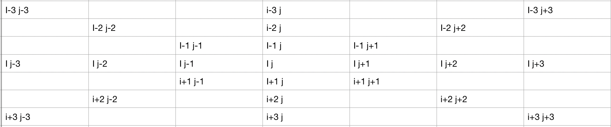
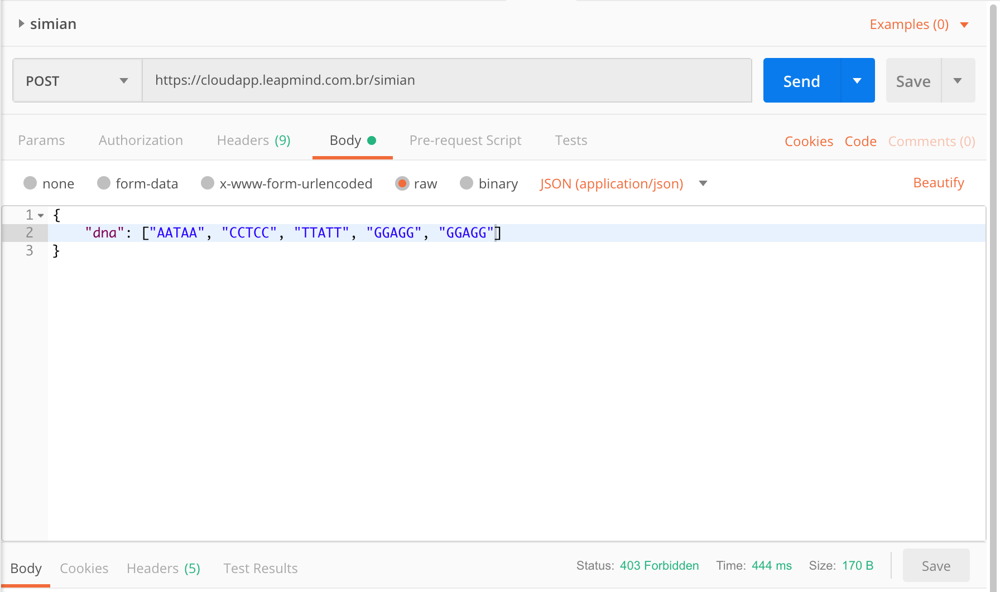
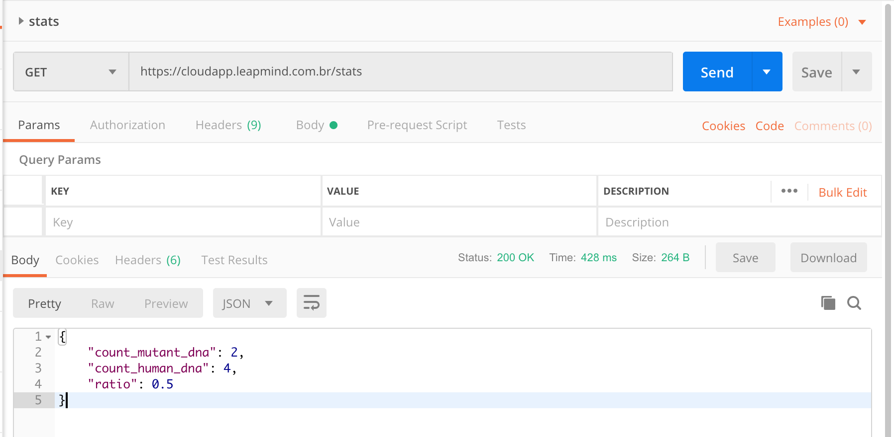
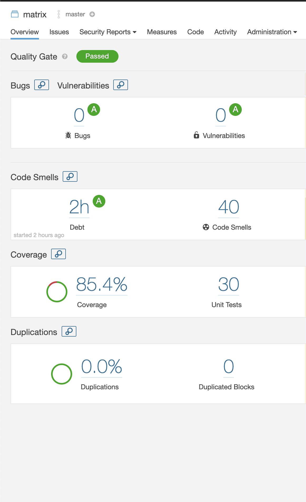

# MELI - MATRIX

### ALGORITMO



Para a solução do problema, foi desenvolvimento um método que analisa todos os elementos da Matriz, checando se seu visinhos são o mesma letra do DNA.
As possibilidades são: 

- itens de uma mesma linha
- itens de uma mesma coluna
- itens na diagonal

Dessa maneira a matriz é percorrida somente uma vez, já eliminando os elementos que não possuem um número de 4 vizinhos.

### HOW TO (API)

#### SIMIAN

##### ENDPOINT

```
https://cloudapp.leapmind.com.br/simian
```

##### BODY

```
{"dna": ["AATAA", "CCTCC", "TTATT", "GGAGG", "GGAGG"]}
```

##### EXEMPLO


#### STATS

##### ENDPOINT

```
https://cloudapp.leapmind.com.br/stats
```

##### EXEMPLO


### HOW TO (RUN)

##### DOCKER BUILD

```
./build.sh
```

##### DOCKER RUN

```
./run.sh
```
obs: run usado na porta 11080

##### DOCKER STOP

```
./stop.sh
```

### SONAR


